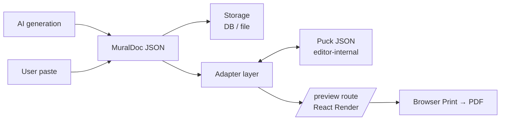

# MuralDoc — Canonical Document Schema

**Status:** Draft v0.1. Approved for drafting in the editor architecture plan; awaiting review.
**Purpose:** Defines the canonical data shape for every PDF that flows through the Mural PDF Generator, independent of any editor library.

## Why this schema exists

Without a canonical schema, the AI generation pipeline, storage, and any editor UI would all be wired directly to Puck's internal `zones`/`ComponentData` format. Swapping editors or upgrading Puck major versions would mean rewriting every prompt, migration, and stored document.

`MuralDoc` is **our** shape. It lives upstream of the editor. An adapter layer converts to and from Puck JSON at the editor boundary only.



## Design principles

1. **Flat, typed, explicit.** Every node has a `type` string discriminator and a `props` object. No implicit layout.
2. **Minimal nesting taxonomy.** Exactly three container levels — Page, Section, Strip — plus leaf Elements. No "container of containers of containers."
3. **Every node has a stable `id`.** UUID or short nanoid. Never positional. Required for AI refinement ("update element abc123") and for diff/merge.
4. **Props match pattern library class and CSS token vocabulary.** A `BodyCopy` prop named `maxMeasure` maps to `max-width: 5.05in`. No invented names.
5. **No styling fields at the element level.** Users edit content and composition; CSS lives in `brand.css`. Exception: optical-adjustment props for logos (`assetScale`, `assetShiftX`, `assetShiftY`) — already scoped in reskin rules.
6. **Forward-compatible.** Every document carries `schemaVersion`. Unknown fields on read are preserved (not dropped) so older clients can't accidentally discard new data written by newer clients.

## Core types

```ts
// Document envelope
export type MuralDoc = {
  schemaVersion: 1;
  docType: DocType;
  meta: DocMeta;
  pages: Page[];
};

export type DocType =
  | "product-one-sheet"
  | "use-case"
  | "competitive-comparison"
  | "pricing-guide"
  | "topic-deep-dive"
  | "program-overview"
  | "partnership-one-sheet";

export type DocMeta = {
  title: string;                // shown on the first page
  topicLabel: string;           // utilitarian label repeated on every page
  audience?: string;            // e.g. "Enterprise buyers"
  tone?: "Professional" | "Conversational" | "Technical" | "Bold";
  outputLength?: "Concise" | "Standard" | "Detailed"; // 1, 2, 3+ pages
  accent?: BrandColorToken;     // document-level accent color key (per spec Inspector §5)
  createdAt: string;            // ISO timestamp
  updatedAt: string;            // ISO timestamp
};

// Page — a fixed 8.5 × 11 in canvas
export type Page = {
  id: string;
  layoutOverride?: LayoutVariant;   // falls back to a doc-type default if omitted
  accentOverride?: BrandColorToken; // per-page override of doc-level accent
  sections: Section[];
};

export type LayoutVariant =
  | "full-width"
  | "two-column-even"
  | "two-column-sidebar"
  | "grid-2x2"
  | "grid-3up"
  | "table-matrix";

// Section — a horizontal page band
export type Section = {
  id: string;
  type: SectionType;
  props?: SectionProps;           // optional per-type props
  strips: Strip[];
};

export type SectionType =
  | "Opener"       // brand bar, topic label, top rule, hero area
  | "Content"      // plain band, optional top rule
  | "StatBand"     // Natural-fill band for stat moments
  | "Closing";     // CTA / contact / footer emphasis

export type SectionProps = {
  suppressTopRule?: boolean;        // per reskin-rules "no rule line before colored blocks"
  background?: "white" | "natural" | "black"; // dot-grid canvas variants
};

// Strip — a multi-piece grouping inside a section
export type Strip = {
  id: string;
  type: StripType;
  props?: Record<string, unknown>;
  // Most strips have a single ordered child list.
  // Multi-slot strips (e.g. FiveColOpenerGrid) use `slots` instead of `children`.
  children?: Element[];
  slots?: Record<string, Element[]>;   // named slots for multi-region strips
};

export type StripType =
  | "FiveColOpenerGrid"   // slots: { main, rail }
  | "CombinedGrid"        // slots: { content, quote } — 5.05in 1fr
  | "PillarGridThreeUp"   // children
  | "PillarGridTwoUp"     // children
  | "LogoStrip"           // children (LogoBox[])
  | "StatCluster"         // children (StatNumeral[])
  | "StatBand"            // children
  | "CompareTable"        // props-driven, not free children
  | "MatrixTable"         // props-driven
  | "AwardCallout"        // children
  | "BodyGroup";          // generic ordered block of Elements

// Element — an individual editable part
export type Element = {
  id: string;
  type: ElementType;
  props: ElementProps;
};

export type ElementType =
  // Text
  | "Headline"         // h1: 31pt / 1.08 / -1.5px
  | "SubHeading"       // h2: 23pt / 1.1 / -1px
  | "SectionHeading"   // h3: 15pt, ABC Social Light
  | "Eyebrow"          // 11.5pt utility label
  | "Deck"             // editorial deck paragraph
  | "IntroCopy"        // intro paragraph below hero, 0.22in top margin
  | "BodyCopy"         // 10pt / 13pt / 6.5pt paragraph
  | "BulletList"       // max 5 items default
  | "NumberedList"
  | "Blockquote"       // variant: "default" | "large" | "display"
  | "Attribution"      // 8.2pt, name bolded, role unbolded
  | "Callout"
  | "InlineLink"       // Blue ADA #3776E4, 1px underline, 2px offset

  // Data / Proof
  | "StatNumeral"      // oversized numeral + label
  | "StateMark"        // ✓ or × (12.5pt, 500) or limited marker
  | "AwardBadge"       // image 0.6in height, border-top rule

  // Images / Logos
  | "PlacedImage"
  | "LogoBox"          // with --asset-scale, --asset-shift-*
  | "PartnerLockup"    // Mural + partner lockup SVG

  // Structural / Page chrome
  | "BrandBar"
  | "TopRule"
  | "PageFooter"
  | "PageNumber"
  | "CTA";

// Element props are unioned by discriminator; only a few are shown here.
// Full prop schemas live alongside their React components.

export type ElementProps =
  | HeadlineProps
  | DeckProps
  | BodyCopyProps
  | BulletListProps
  | BlockquoteProps
  | LogoBoxProps
  | StatNumeralProps
  | InlineLinkProps
  | Record<string, unknown>; // fallback during draft

export type HeadlineProps = {
  text: string;               // bounded: maxLines 4
  level?: 1 | 2;              // h1 default
};

export type DeckProps = {
  text: string;               // bounded: 45–75 words
};

export type BodyCopyProps = {
  // Rich text stored as a small, explicit node tree. No HTML strings.
  // Allowed inline marks: bold, link (link color hardcoded to #3776E4).
  content: InlineNode[];
  maxMeasure?: "body-copy";   // renders as max-width: min(5.05in, 100%) — widths live on leaves, not parents
};

export type InlineNode =
  | { type: "text"; value: string; marks?: Array<"bold"> }
  | { type: "link"; href: string; label: string; marks?: Array<"bold"> };

export type BulletListProps = {
  items: Array<{ content: InlineNode[] }>; // bounded: max 5 items
  style?: "bullet" | "number";
};

export type BlockquoteProps = {
  text: string;               // bounded: 20–45 words
  variant: "default" | "large" | "display";
  attribution?: {
    name: string;
    role?: string;
    logoKey?: string;         // references logo-manifest.json
  };
};

export type LogoBoxProps = {
  logoKey: string;            // key into logo-manifest.json
  variant: "auto" | "B" | "W"; // auto picks based on section background
  assetScale?: number;        // default 1
  assetShiftX?: string;       // e.g. "-0.02in"
  assetShiftY?: string;
};

export type StatNumeralProps = {
  numeral: string;            // e.g. "87%"
  label: string;              // short explanatory line
  source?: string;            // optional attribution
};

export type InlineLinkProps = {
  href: string;
  label: string;
};

// Brand color tokens map to the palette in .cursorrules
export type BrandColorToken =
  | "jade" | "mural-green" | "mural-red" | "mural-blue"
  | "mural-pink" | "mural-yellow" | "spring" | "mint"
  | "natural" | "black" | "white";
```

## Element type catalog for v1 (Product one-sheet)

Scoping the prototype to one doc type means a subset of the full catalog. These 15 types cover a Product one-sheet end to end:

1. `BrandBar` (element, page chrome)
2. `Eyebrow` — topic label
3. `Headline`
4. `Deck`
5. `IntroCopy`
6. `BodyCopy`
7. `BulletList`
8. `SubHeading`
9. `Blockquote` (default + display variants)
10. `Attribution`
11. `LogoBox`
12. `StatNumeral`
13. `CTA`
14. `PageFooter`
15. `InlineLink` (inline mark, not standalone)

Plus 4 section types (`Opener`, `Content`, `StatBand`, `Closing`) and 5 strip types (`FiveColOpenerGrid`, `CombinedGrid`, `PillarGridThreeUp`, `LogoStrip`, `StatCluster`).

Grand total for the prototype: **~24 registered entities**, consistent with the engineer reviewer's "realistic 12–15 leaf components + frames" estimate.

## Example document

A one-page product one-sheet in full `MuralDoc` form:

```json
{
  "schemaVersion": 1,
  "docType": "product-one-sheet",
  "meta": {
    "title": "Mural for Enterprise",
    "topicLabel": "Trust & Security",
    "audience": "Enterprise IT buyers",
    "tone": "Professional",
    "outputLength": "Concise",
    "accent": "jade",
    "createdAt": "2026-04-23T14:00:00Z",
    "updatedAt": "2026-04-23T14:05:00Z"
  },
  "pages": [
    {
      "id": "page-1",
      "sections": [
        {
          "id": "sec-opener",
          "type": "Opener",
          "strips": [
            {
              "id": "strip-hero",
              "type": "FiveColOpenerGrid",
              "slots": {
                "main": [
                  { "id": "el-headline", "type": "Headline",
                    "props": { "text": "Work safely at enterprise scale." } },
                  { "id": "el-deck", "type": "Deck",
                    "props": { "text": "Mural meets the controls IT leaders require, so teams can collaborate without giving up security, scalability, or governance." } }
                ],
                "rail": [
                  { "id": "el-rail-h", "type": "SubHeading", "props": { "text": "Security" } },
                  { "id": "el-rail-body", "type": "BodyCopy",
                    "props": { "content": [
                      { "type": "text", "value": "SOC 2 Type II, ISO 27001, HIPAA. Enforced SSO and workspace-level DLP." }
                    ] } }
                ]
              }
            }
          ]
        },
        {
          "id": "sec-proof",
          "type": "Content",
          "strips": [
            {
              "id": "strip-logos",
              "type": "LogoStrip",
              "children": [
                { "id": "el-logo-1", "type": "LogoBox", "props": { "logoKey": "ibm", "variant": "B" } },
                { "id": "el-logo-2", "type": "LogoBox", "props": { "logoKey": "booz-allen", "variant": "B", "assetScale": 0.85 } },
                { "id": "el-logo-3", "type": "LogoBox", "props": { "logoKey": "pitney-bowes", "variant": "B" } },
                { "id": "el-logo-4", "type": "LogoBox", "props": { "logoKey": "jacobs", "variant": "B" } }
              ]
            }
          ]
        }
      ]
    }
  ]
}
```

## Versioning & migration

Every document starts with `schemaVersion: 1`. When the schema changes materially:

- Add a new version number.
- Write a migration function `migrateV1toV2(doc: MuralDocV1): MuralDocV2`.
- Storage reads run the migration chain on load; writes always emit the latest version.
- The adapter to Puck JSON is versioned alongside. A `MuralDoc v1` only pairs with its matching Puck config.

Breaking-change rules:
- Renaming an element type: write a type-rewrite in the migration.
- Splitting a type (e.g. `Blockquote` → `Blockquote` + `BlockquoteDisplay`): migration maps old `variant` to the new type.
- Removing a type: migration replaces with the closest equivalent and logs a warning; the user sees the replacement on next open.
- Adding a new optional prop: no migration needed; readers treat unknown props as pass-through.

## Adapter to Puck JSON

`MuralDoc` is the canonical format. Puck JSON is an editor-internal representation. The adapter is the only place Puck's shape is referenced.

```ts
export function muralDocToPuck(doc: MuralDoc): PuckData;
export function puckToMuralDoc(puck: PuckData, meta: DocMeta): MuralDoc;
```

Adapter guarantees tested in round-trip:

```ts
// 1. Identity: any MuralDoc survives a round trip through Puck.
expect(puckToMuralDoc(muralDocToPuck(doc), doc.meta)).toEqual(doc);

// 2. Stable ids: every node id is preserved across the round trip.
// 3. No data loss: no field on any element is dropped silently.
// 4. Puck-specific fields (zones, ComponentData wrapping) live only inside Puck.
```

## Validation rules (content guardrails)

Lived on the schema and enforced by custom Puck bounded fields.

| Element | Constraint | Source | Implemented |
|--------|-----------|--------|------------|
| `Headline.text` | 2–4 lines (≈ 90 chars max per line at h1 size) | PDF-GENERATOR-SPEC.md line 177 | ✓ A13 |
| `Deck.text` | 45–75 words | PDF-GENERATOR-SPEC.md line 178 | ✓ A13 |
| `BulletList.items` | 2–5 items | PDF-GENERATOR-SPEC.md line 179 | ✓ A13 |
| `Blockquote.text` | 20–45 words | PDF-GENERATOR-SPEC.md line 180 | ✓ A13 |
| `LogoStrip.children` | 3–6 `LogoBox` items | PDF-GENERATOR-SPEC.md line 181 | ✓ A13 |
| `BodyCopy.content` (aggregate) | page body ≈ 180–260 words | PDF-GENERATOR-KIT.md line 124 | deferred — cross-element |
| `InlineNode.link.href` | must be valid URL; link color forced to `#3776E4` at render | reskin-rules.mdc "Link color" | deferred — belongs in rich-text-html parser |
| `InlineNode.text.marks[bold]` | renders as `strong { font-weight: 700 }` — no other weights | reskin-rules.mdc Typography | enforced at render by CSS |

Overflow behavior: live counter + soft warning + "AI trim suggestion" button + override-with-warning. Never silently drop content.

**A13 mechanism.** Each implemented row is declared on the Puck field via `metadata: { bounded: { kind, min, max } }` in [`editor-app/src/puck/config.tsx`](editor-app/src/puck/config.tsx). A Puck `overrides.fieldTypes.{text,textarea,richtext,array,slot}` wrapper in [`editor-app/src/puck/bounded-overrides.tsx`](editor-app/src/puck/bounded-overrides.tsx) reads that metadata, runs [`editor-app/src/puck/bounded.ts`](editor-app/src/puck/bounded.ts) counters, and renders a soft badge below the inspector input. No hard limit — save always succeeds.

## Round-trip and print guarantees

The schema is only as valuable as the invariants it upholds. The following must hold in CI:

1. **Round-trip identity:** `puckToMuralDoc(muralDocToPuck(doc)) === doc` for any valid doc.
2. **ID stability:** every node's `id` survives the round trip unchanged.
3. **Render determinism:** rendering the same `MuralDoc` produces pixel-identical output at `/preview` across runs.
4. **Visual regression:** rendering a seed `MuralDoc` for Product one-sheet matches [reskins/product-one-sheet/mural-overview.html](reskins/product-one-sheet/mural-overview.html) within 0.1% pixel delta.
5. **Print parity:** browser `File > Print` on `/preview/:docId` produces a PDF indistinguishable from printing the equivalent reskin HTML.

Any of these failing blocks merge.

## What this schema deliberately does NOT include

- **Absolute positioning.** Everything flows. Absolute positioning is what turns a print-first system into a form-editor.
- **Free-form CSS.** No `style` props, no class names at the node level. All styling comes from `brand.css` via the element `type`.
- **Nested rich text beyond `InlineNode`.** No bullet-lists-inside-paragraphs. If you need a list, use `BulletList`.
- **Arbitrary HTML.** No `html` props, no `dangerouslySetInnerHTML` escape hatches.
- **Multi-tenant / collaboration fields.** No owners, no permissions, no presence. Those belong in storage/API layer, not the document itself.

## Open questions (not blockers for v0.1)

- **Rich-text tree depth.** Is `InlineNode` flat (current draft) or does it need nested spans for e.g. bold-inside-link? Leaning flat — never needed in the existing reskins.
- **Page-level layout props.** Do we expose `LayoutVariant` overrides per page, or derive layout purely from the section/strip composition? Current draft includes `layoutOverride` as optional; may be removed if composition is expressive enough.
- **Accent theming.** Spec says document-level accent + per-page overrides. Draft includes both. Confirmed after prototype with real designs.
- **Partner lockup special case.** The partnership doc-type has a fixed lockup SVG. Is it an element, a strip prop, or a page prop? Probably an element (`PartnerLockup`) with fixed placement in the `Opener` section — decide during partnership doc-type work (not v1 scope).

## Next steps after schema review

1. Review this draft with brand and engineering. Revise to v0.2 if needed.
2. Draft `EDITOR-COMPONENT-INVENTORY.md` — the 24 registered entities for Product one-sheet with full prop specs and pattern-library line citations.
3. Stand up `editor-app/` scaffolding (Next.js, no Puck yet): schema types, validators, adapter stub, one round-trip test.
4. Begin copying `brand.css` (additive step 3 of the migration).
